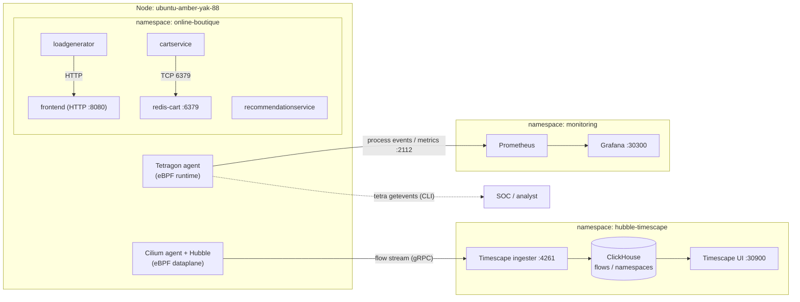
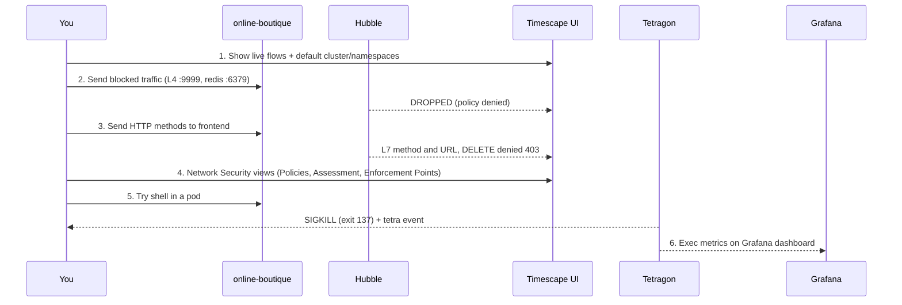

# Isovalent Enterprise — End‑to‑End Demo Runbook

A stage‑ready walkthrough of the **Isovalent Enterprise for Cilium** capabilities built in this
environment: network observability + historical analytics (**Hubble Timescape**), **L3/L4 and L7
network policy** with enforcement and correlation, the Timescape **Network Security** views
(Policies, Assessment, Enforcement Points), and **Tetragon** runtime security (detection +
Sigkill enforcement) surfaced both on the CLI and in a **Grafana** dashboard.

> Terminology: **SCC** = Cisco Security Cloud Control, **cdFMC** = cloud‑delivered FMC.

---

## 0. Environment & access

| Component | Where | Access |
|-----------|-------|--------|
| Kubernetes (single node) | `ubuntu-amber-yak-88` (192.168.7.10) | `ssh -J administrator@198.18.133.11 ubuntu@192.168.7.10 -p 32095` |
| CNI / observability | Isovalent Enterprise Cilium 1.18 + Hubble | — |
| Historical analytics | Hubble **Timescape Lite** | **Timescape UI** — NodePort **30900** |
| Runtime security | **Tetragon** 1.18 | `tetra getevents` CLI |
| Metrics UI | Prometheus + **Grafana** | **Grafana** — NodePort **30300** (admin/admin) |
| Demo app | Online Boutique | namespace `online-boutique` |

Open the UIs the same way you already open Timescape (`http://<node-or-tunnel>:30900`); Grafana is
the same host on `:30300`. For an SSH tunnel: add `-L 30900:localhost:30900 -L 30300:localhost:30300`
to the `ssh` command and browse `http://localhost:30900` / `:30300`.

---

## 1. Architecture (what you're demoing)



**Two complementary planes:**
- **Network plane** — Cilium/Hubble → Timescape (flows, L3/L4/L7 policy verdicts, policy analysis).
- **Runtime plane** — Tetragon → CLI (live process events + Sigkill) and Prometheus/Grafana (aggregate metrics).

---

## 2. Demo flow at a glance



---

## 3. Part 1 — Network observability (Timescape)

**Goal:** show real‑time + historical network flows with full Kubernetes identity.

Steps:
1. In **Timescape UI (:30900)** → **Observability → Flows**.
2. Select cluster **`default`**, namespace **`online-boutique`**.
3. Point out flows between microservices (frontend → productcatalog/cart/checkout, etc.) with pod,
   namespace, workload, verdict.

CLI cross‑check:
```bash
CIL=$(kubectl -n kube-system get pod -l k8s-app=cilium -o jsonpath='{.items[0].metadata.name}')
kubectl -n kube-system exec $CIL -c cilium-agent -- hubble observe --namespace online-boutique --last 20
```

**Message:** identity‑aware (not IP‑based) observability, live and stored for historical
investigation — no app instrumentation.

---

## 4. Part 2 — L3/L4 zero‑trust (east‑west)

**Goal:** micro‑segmentation; blocked traffic visible as policy‑denied drops.

Policy: [`policies/redis-cart-allow-cartservice.yaml`](policies/redis-cart-allow-cartservice.yaml)
(allow `redis-cart:6379` only from `cartservice`).

```bash
kubectl apply -f policies/redis-cart-allow-cartservice.yaml
# generate a denied flow (recommendationservice is NOT allowed to reach redis)
REDIS=$(kubectl -n online-boutique get pod -l app=redis-cart -o jsonpath='{.items[0].status.podIP}')
REC=$(kubectl -n online-boutique get pod -l app=recommendationservice -o jsonpath='{.items[0].metadata.name}')
kubectl -n online-boutique exec $REC -- python3 -c "import socket;s=socket.socket();s.settimeout(3);s.connect(('$REDIS',6379))" || echo "BLOCKED"
```

In **Timescape → Flows**: filter destination `redis-cart`, verdict **Dropped** → the
`recommendationservice` denials appear; `cartservice → redis` stays **Forwarded** (app works).

**Message:** default‑deny east‑west, enforced in‑kernel, with the drop attributed to the policy.

---

## 5. Part 3 — L7 HTTP visibility + enforcement

**Goal:** application‑layer (HTTP) visibility and method‑level enforcement from one policy.

Policy: [`policies/frontend-l7-http.yaml`](policies/frontend-l7-http.yaml) (allow only `GET`/`POST`
on `frontend:8080`). A single L7 ingress rule also default‑denies other ports.

```bash
kubectl apply -f policies/frontend-l7-http.yaml
# make sure no plain L4 allow-all on 8080 exists, or it overrides the L7 deny:
kubectl -n online-boutique delete netpol allow-frontend-ingress --ignore-not-found

FE=$(kubectl -n online-boutique get pod -l app=frontend -o jsonpath='{.items[0].status.podIP}')
LG=$(kubectl -n online-boutique get pod -l app=loadgenerator -o jsonpath='{.items[0].metadata.name}')
# allowed:
kubectl -n online-boutique exec $LG -c main -- python3 -c "import http.client;c=http.client.HTTPConnection('$FE',8080,timeout=5);c.request('GET','/');print('GET',c.getresponse().status)"
# denied at L7 (403):
kubectl -n online-boutique exec $LG -c main -- python3 -c "import http.client;c=http.client.HTTPConnection('$FE',8080,timeout=5);c.request('DELETE','/');r=c.getresponse();print('DELETE',r.status,r.reason)"
# denied at L4 (other port):
kubectl -n online-boutique exec $LG -c main -- python3 -c "import socket;s=socket.socket();s.settimeout(3);s.connect(('$FE',9999))" || echo "9999 BLOCKED"
```

In **Timescape → Flows**, destination `frontend`:
- **Forwarded** flows show **HTTP method / URL / status** (e.g. `GET / 200`, `POST /cart 200`).
- **Dropped** shows `DELETE → 403` (L7) and `:9999` (L4).

**Message:** one policy delivers L7 visibility **and** enforcement; drops carry HTTP context, not just ports.

---

## 6. Part 4 — Timescape Network Security views

**Goal:** show the security‑posture tooling (Beta features we enabled).

In **Timescape UI → Network Security**:
- **Policies** — the applied CiliumNetworkPolicies and their scope.
- **Assessment (Beta)** — zero‑trust benchmark scoring (analyzer runs on a 24h schedule).
- **Enforcement Points (Beta)** — where policies are enforced.

Enabled via [`scripts/02-enable-timescape-beta-features.sh`](scripts/02-enable-timescape-beta-features.sh).

**Message:** move from raw flows to **posture** — scoring, gaps, and enforcement coverage.

---

## 7. Part 5 — Tetragon runtime detection (CLI)

**Goal:** kernel‑level process visibility with full ancestry — no sidecar.

Split screen — left pane (stream), right pane (trigger):
```bash
# LEFT: live events
kubectl -n tetragon exec ds/tetragon -c tetragon -- tetra getevents -o compact
# RIGHT: run something in a pod
kubectl -n online-boutique exec deploy/loadgenerator -c main -- sh -c 'cat /etc/passwd; id; whoami'
```
Audience sees `🚀 process … /usr/bin/cat /etc/passwd`, `id`, `whoami` with pod + args + parent.

**Message:** "who ran what, where" inside containers — audit‑grade runtime visibility.

---

## 8. Part 6 — Tetragon enforcement (Sigkill)

**Goal:** prevent, not just detect.

Policy: [`../tetragon/block-shell-exec.yaml`](../tetragon/block-shell-exec.yaml).

```bash
kubectl apply -f ../tetragon/block-shell-exec.yaml
LG=$(kubectl -n online-boutique get pod -l app=loadgenerator -o jsonpath='{.items[0].metadata.name}')
kubectl -n online-boutique exec $LG -c main -- sh -c 'echo hi'   # -> command terminated with exit code 137
kubectl -n online-boutique get pod $LG --no-headers              # still 1/1 Running
```

**Message:** an attacker popping a shell in a pod is **killed instantly in‑kernel**; the workload
keeps running. Namespaced, so blast radius is contained.

---

## 9. Part 7 — Grafana runtime dashboard

**Goal:** a UI for runtime metrics (aggregate) alongside the network UI.

- **Grafana (:30300)**, admin/admin → dashboard **“Tetragon Runtime Security”**.
- Panels: process‑exec totals, exec‑rate by namespace, top executed binaries, events by type.
- Generate activity (run commands in `loadgenerator`) and watch panels move.

Built via [`../tetragon/scripts/01-install-grafana-tetragon.sh`](../tetragon/scripts/01-install-grafana-tetragon.sh).

**Message:** Tetragon feeds Prometheus for trend/aggregate dashboards; the live process tree +
Sigkill event stay in `tetra getevents`. Timescape (network) + Grafana (runtime) together give a
full security picture.

---

## 10. Key messages (talk track)

- **Identity‑aware, not IP‑aware** — everything is tied to pod/namespace/workload.
- **Observe → segment → enforce** — flows, then L4/L7 policy, then runtime enforcement.
- **Network + runtime** — Cilium/Timescape (L3–L7) *and* Tetragon (process/file/syscall) in one platform.
- **Historical** — Timescape stores flows for after‑the‑fact investigation.
- **No app changes** — all eBPF, zero instrumentation.

---

## 11. Reset between runs

```bash
# network policies
kubectl -n online-boutique delete cnp frontend-l7-http redis-cart-allow-cartservice --ignore-not-found
# runtime policy
kubectl -n online-boutique delete tracingpolicynamespaced block-shell-exec --ignore-not-found
```

Re‑apply from `policies/` and `tetragon/` to restore the demo.

> Screenshots: capture the Timescape Flows/Network‑Security pages and the Grafana dashboard live
> from your environment and drop them into a `docs/img/` folder — real UI captures land better with
> an audience than static images, and this environment's data is already populated.
