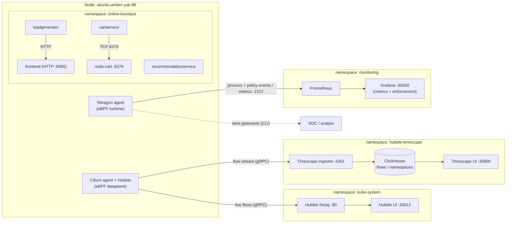
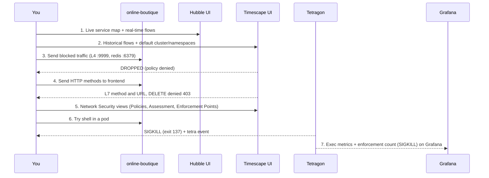

# Isovalent Enterprise — End‑to‑End Demo Runbook

A stage‑ready walkthrough of the **Isovalent Enterprise for Cilium** capabilities built in this
environment: network observability + historical analytics (**Hubble Timescape**), **L3/L4 and L7
network policy** with enforcement and correlation, the Timescape **Network Security** views
(Policies, Assessment, Enforcement Points), and **Tetragon** runtime security (detection +
Sigkill enforcement) surfaced both on the CLI and in a **Grafana** dashboard.

> Terminology: **SCC** = Cisco Security Cloud Control, **cdFMC** = cloud‑delivered FMC.

---

## 0. Environment & access

| Component | Where | Access |
|-----------|-------|--------|
| Kubernetes (single node) | `ubuntu-amber-yak-88` (192.168.7.10) | `ssh -J administrator@198.18.133.11 ubuntu@192.168.7.10 -p 32095` |
| CNI / observability | Isovalent Enterprise Cilium 1.18 + Hubble | — |
| Live network map | Hubble **Relay + UI** | **Hubble UI** — NodePort **30012** |
| Historical analytics | Hubble **Timescape Lite** | **Timescape UI** — NodePort **30900** |
| Runtime security | **Tetragon** 1.18 | `tetra getevents` CLI |
| Metrics UI | Prometheus + **Grafana** | **Grafana** — NodePort **30300** (admin / see secret†) |
| Demo app | Online Boutique | namespace `online-boutique`, frontend **NodePort 30080** |

### The four UIs (all on host 192.168.7.10)

| UI | NodePort | What it's for |
|----|----------|---------------|
| Online Boutique | **30080** | the live app you're observing/protecting |
| Hubble UI | **30012** | **live** service map + real‑time flows |
| Timescape | **30900** | **historical** flows + Network Security (posture) |
| Grafana | **30300** | Tetragon runtime metrics **+ enforcement** dashboard (admin / see secret†) |

> † **Grafana admin password** is not stored in this repo. Fetch it from the cluster:
> ```bash
> kubectl -n monitoring get secret kps-grafana -o jsonpath='{.data.admin-password}' | base64 -d; echo
> ```

Open the UIs the same way you already open Timescape. For an SSH tunnel, forward all four ports:

```bash
ssh -J administrator@198.18.133.11 ubuntu@192.168.7.10 -p 32095 -N \
  -L 30080:localhost:30080 \
  -L 30012:localhost:30012 \
  -L 30300:localhost:30300 \
  -L 30900:localhost:30900
```

Then browse `http://localhost:30080` (shop), `:30012` (Hubble), `:30900` (Timescape), `:30300`
(Grafana). Leave that terminal open for the whole session.

> Live vs historical: **Hubble UI (30012)** is the real‑time service map (what's happening *now*);
> **Timescape (30900)** is the time machine (what happened *then*, plus posture scoring). Show both
> to contrast live observability with historical forensics.

---

## 0.5 One‑hour run sheet (minute‑by‑minute)

**Screen layout:** browser with **4 tabs pre‑opened** (Boutique `:30080`, Hubble `:30012`,
Timescape `:30900`, Grafana `:30300`) **+** a terminal **split into two panes** (left = Tetragon
event stream, right = your "attacker"/commands). Keep the SSH tunnel terminal running separately.

**Pre‑flight (do before the audience joins):**
```bash
# 1) tunnel up (leave running)
ssh -J administrator@198.18.133.11 ubuntu@192.168.7.10 -p 32095 -N \
  -L 30080:localhost:30080 -L 30012:localhost:30012 \
  -L 30300:localhost:30300 -L 30900:localhost:30900 &
# 2) confirm the 4 UIs answer
for p in 30080 30012 30900 30300; do curl -s -o /dev/null -w "$p=%{http_code}\n" http://localhost:$p/; done
# 3) clean slate: remove policies so you can apply them live
kubectl -n online-boutique delete cnp frontend-l7-http redis-cart-allow-cartservice --ignore-not-found
kubectl -n online-boutique delete tracingpolicynamespaced block-shell-exec --ignore-not-found
# 4) log into Grafana once (admin / password from kps-grafana secret — see §0 †) and open "Tetragon Runtime Security"
```

| Time | Scene | UI / pane | Do this | Section |
|------|-------|-----------|---------|---------|
| **0:00–0:03** | Intro & context | Online Boutique `:30080` | Click around the shop. "Real e‑commerce app, Kubernetes, no agents inside it, no code changes." | §0–1 |
| **0:03–0:10** | Live service map | **Hubble UI** `:30012` | Namespace `online-boutique`; watch the map draw; click an edge → live flows by identity. | §3a |
| **0:10–0:18** | Historical + identity | **Timescape** `:30900` | Observability → Flows, cluster `default`, ns `online-boutique`; expand a flow; drag the time slider back. | §3b |
| **0:18–0:27** | L4 zero‑trust | Timescape (+ Hubble) | Apply redis policy live; run the blocked connection; filter **Dropped** → `recommendationservice → redis-cart` denied, `cartservice` still allowed. | §4 |
| **0:27–0:36** | L7 HTTP visibility + enforcement | Timescape `:30900` | Apply L7 policy; show `GET/POST 200` with method/URL; `DELETE → 403`; `:9999 → L4 drop`. | §5 |
| **0:36–0:43** | Security posture | Timescape → Network Security | Policies inventory → Assessment score/coverage → Enforcement Points. | §6 |
| **0:43–0:47** | Runtime detection | **Terminal (split)** | Left: `tetra getevents -o compact`. Right: `cat /etc/passwd; id` in a pod → events stream live. Network is silent — that's the point. | §7 |
| **0:47–0:53** | Runtime enforcement | **Terminal (split)** | Apply `block-shell-exec`; try a shell → **exit 137 (SIGKILL)**; show the app pod still `1/1 Running`. | §8 |
| **0:53–0:58** | The scoreboard | **Grafana** `:30300` | Open dashboard; run a few more blocked shells; watch **Enforcement actions (SIGKILL)** tick up + the rate panel spike. | §9 |
| **0:58–1:00** | Wrap | — | "See it (Hubble/Timescape) → segment it (policy) → stop it (Tetragon) → prove it (Grafana). One platform, all eBPF, zero app changes." | §10 |

**If you're running short (~40 min):** drop §6 (Assessment) and §3b's time‑slider deep‑dive; keep
Hubble live map, one policy (L7), and the full Tetragon detect→enforce→Grafana arc — that's the
strongest through‑line.

**Reset between runs:** see §11.

---

## 1. Architecture (what you're demoing)



### What each component is doing

| Component | Layer | What it does in this demo |
|-----------|-------|---------------------------|
| **Online Boutique** (`online-boutique`) | app | The workload we observe and protect: a web `frontend` (HTTP :8080) talking to gRPC microservices; `cartservice` uses `redis-cart` (:6379); `loadgenerator` continuously drives realistic traffic so the UIs always have live data. |
| **Cilium agent + Hubble** (`kube-system`) | network dataplane (eBPF) | The CNI. It moves every packet in the kernel via eBPF, **enforces** the CiliumNetworkPolicies (L3/L4 and L7/HTTP), and via **Hubble** emits a *flow record* for each connection (source/dest identity, port, verdict, and HTTP method/URL/status when L7 is on). |
| **Hubble Relay + UI** (`kube-system` :30012) | live network UI | Relay aggregates the Hubble flow streams from the Cilium agent(s); the Hubble UI renders them as a **real‑time service map** + live flows table. This is the *live* network pane (complement to Timescape's *historical* pane). |
| **Timescape ingester** (`hubble-timescape` :4261) | pipeline | Receives the Hubble flow stream from Cilium and writes it into ClickHouse. This is the link we had to fix — without it the UI shows nothing. |
| **ClickHouse** (`hubble-timescape`) | store | The time‑series database that holds flows + derived namespace/cluster tables. This is what makes Timescape *historical* (last 1h in Lite). |
| **Timescape UI** (`hubble-timescape` :30900) | network UI | The single pane for **Flows** (observability) and **Network Security** (Policies, Assessment, Enforcement Points). Everything you show on the network side is here. |
| **Tetragon agent** (`tetragon`, DaemonSet) | runtime security (eBPF) | Separate eBPF programs that watch **inside** the containers: process exec/exit, file access, network, capabilities — and can **kill** (Sigkill) on a match. This is the runtime plane, complementary to Cilium's network plane. |
| **Prometheus + Grafana** (`monitoring`) | metrics UI | Prometheus scrapes Tetragon's aggregate metrics (`tetragon_events_total`); Grafana visualises them (exec counts/rates per namespace/binary). Gives a *dashboard* view of runtime activity. |

**Two complementary planes — the core story:**
- **Network plane** — Cilium/Hubble → Timescape answers *"who is talking to whom, and was it allowed?"* (L3/L4/L7).
- **Runtime plane** — Tetragon → CLI + Grafana answers *"what is running inside the pods, and can I stop it?"* (process/file/syscall).

One platform, both planes, all eBPF, **no changes to the application**.

---

## 2. Demo flow at a glance



---

## 3. Part 1 — Network observability (Hubble UI live + Timescape historical)

The network story has **two panes**: **Hubble UI** shows what's happening *live* right now (a moving
service map); **Timescape** is the *historical* record you scrub back through. Show live first, then
the time machine.

### 3a. Hubble UI — the live service map

**What we're doing:** with zero changes to the app, watch every service‑to‑service connection in
real time, as an animated dependency graph keyed by Kubernetes identity (not IP).

**Where to click (step by step)**
1. Open **Hubble UI** → `http://<host>:30012`.
2. Top‑left **namespace** dropdown → select **`online-boutique`**.
3. Watch the **service map** draw itself: `loadgenerator → frontend → productcatalog / cart /
   checkout …`, with animated edges as traffic flows.
4. Click any **edge** (or a service node) → the right‑hand **flows table** filters to that
   conversation: source/destination identity, port, verdict (Forwarded/Dropped), and L7 (HTTP
   method/path) once the L7 policy is on.
5. Use the **verdict filter** (top bar) → set **Dropped** later (Parts 2–3) to watch denials appear
   live.

**Talk track**
> "This is Hubble UI — a live map of the application, built entirely from eBPF in the kernel. I
> haven't touched the app, yet every microservice and every call between them is drawn here in real
> time, by *identity* — `frontend`, `cartservice`, `checkout` — not by throwaway pod IPs. When we
> start blocking traffic in a minute, you'll see the denied edges light up right here as it happens."

**Key point to land:** live, identity‑aware service map — the real‑time half of observability.

### 3b. Timescape — the historical record

**What we're doing:** proving that, with zero changes to the app, we can see every network
conversation in the cluster by *Kubernetes identity* (pod / namespace / workload) instead of by
random pod IPs — live, and stored for later investigation.

### Where to click (step by step)
1. Open **Timescape UI** → `http://<host>:30900`.
2. Left sidebar → **Observability → Flows**.
3. Top of the page, in the **Choose cluster** dropdown, pick **`default`**. *(This dropdown being
   populated is itself the proof the flow pipeline works — earlier it said "No matches".)*
4. In the filter bar, add **Namespace = `online-boutique`**. The table fills with live flows.
5. Click any single flow row to expand it — show the fields: **source pod/workload**, **destination
   service**, **port**, **verdict = Forwarded**, and the **timestamp**.
6. Drag the **time range** back a few minutes to show the same data existed in the past (historical).

### Talk track (the story)
> "This is a live e‑commerce app — Online Boutique — running on Kubernetes with Cilium as the
> network layer. I haven't installed any agent *inside* these apps and I haven't changed a line of
> their code. Yet here in Timescape I can see every single connection between the microservices.
>
> Notice the table doesn't talk about IP addresses — it talks about **identities**: `frontend`
> talking to `productcatalogservice`, `checkoutservice` calling `paymentservice`. In Kubernetes,
> pods come and go and IPs are recycled constantly, so IP‑based tools are blind. Cilium tags every
> workload with an identity in the kernel, so what you get is *service‑level* truth.
>
> And this isn't just a live tail — it's a **time machine**. If someone asks 'what happened at
> 2am last night?', I scrub the time slider and the flows are right there. That's Hubble Timescape:
> historical network forensics, captured with eBPF, no instrumentation, no packet mirroring."

### CLI cross‑check (optional, to prove it's real)
```bash
CIL=$(kubectl -n kube-system get pod -l k8s-app=cilium -o jsonpath='{.items[0].metadata.name}')
kubectl -n kube-system exec $CIL -c cilium-agent -- hubble observe --namespace online-boutique --last 20
```
> "Same data, straight from the kernel — Timescape is just storing and visualising this stream."

---

## 4. Part 2 — L3/L4 zero‑trust (east‑west)

**Goal:** micro‑segmentation; blocked traffic visible as policy‑denied drops.

Policy: [`policies/redis-cart-allow-cartservice.yaml`](policies/redis-cart-allow-cartservice.yaml)
(allow `redis-cart:6379` only from `cartservice`).

```bash
kubectl apply -f policies/redis-cart-allow-cartservice.yaml
# generate a denied flow (recommendationservice is NOT allowed to reach redis)
REDIS=$(kubectl -n online-boutique get pod -l app=redis-cart -o jsonpath='{.items[0].status.podIP}')
REC=$(kubectl -n online-boutique get pod -l app=recommendationservice -o jsonpath='{.items[0].metadata.name}')
kubectl -n online-boutique exec $REC -- python3 -c "import socket;s=socket.socket();s.settimeout(3);s.connect(('$REDIS',6379))" || echo "BLOCKED"
```

### Where to click
1. **Timescape → Observability → Flows**, cluster `default`, namespace `online-boutique`.
2. Add filters: **Destination = `redis-cart`** and **Verdict = Dropped**.
3. Show the rows: `recommendationservice → redis-cart:6379` with verdict **Dropped**.
4. Change the verdict filter to **Forwarded** → `cartservice → redis-cart` is still allowed.

### Talk track (the story)
> "Right now the app is flat — any pod can reach any other pod. That's how most breaches spread:
> get into one container, then move sideways. Let's fix that with a zero‑trust policy.
>
> This one rule says: *only `cartservice` may talk to the `redis-cart` database on port 6379 —
> everyone else is denied by default.* I apply it… and it takes effect instantly, enforced in the
> Linux kernel by eBPF — no firewall, no sidecar, no pod restart.
>
> Now watch. I'll have `recommendationservice` — which has no business touching the cart database —
> try to connect. In Timescape I filter for the redis database and 'Dropped', and there it is:
> the attempt is blocked, and crucially it's **attributed to the policy** that denied it. Meanwhile
> `cartservice`, which *is* allowed, keeps working and the shop never breaks.
>
> That's micro‑segmentation: least‑privilege between services, and full visibility of what got
> blocked and why."

**Key point to land:** default‑deny east‑west, enforced in‑kernel, with each drop tied back to the
exact policy — visible in the same UI as the flows.

---

## 5. Part 3 — L7 HTTP visibility + enforcement

**Goal:** application‑layer (HTTP) visibility and method‑level enforcement from one policy.

Policy: [`policies/frontend-l7-http.yaml`](policies/frontend-l7-http.yaml) (allow only `GET`/`POST`
on `frontend:8080`). A single L7 ingress rule also default‑denies other ports.

```bash
kubectl apply -f policies/frontend-l7-http.yaml
# make sure no plain L4 allow-all on 8080 exists, or it overrides the L7 deny:
kubectl -n online-boutique delete netpol allow-frontend-ingress --ignore-not-found

FE=$(kubectl -n online-boutique get pod -l app=frontend -o jsonpath='{.items[0].status.podIP}')
LG=$(kubectl -n online-boutique get pod -l app=loadgenerator -o jsonpath='{.items[0].metadata.name}')
# allowed:
kubectl -n online-boutique exec $LG -c main -- python3 -c "import http.client;c=http.client.HTTPConnection('$FE',8080,timeout=5);c.request('GET','/');print('GET',c.getresponse().status)"
# denied at L7 (403):
kubectl -n online-boutique exec $LG -c main -- python3 -c "import http.client;c=http.client.HTTPConnection('$FE',8080,timeout=5);c.request('DELETE','/');r=c.getresponse();print('DELETE',r.status,r.reason)"
# denied at L4 (other port):
kubectl -n online-boutique exec $LG -c main -- python3 -c "import socket;s=socket.socket();s.settimeout(3);s.connect(('$FE',9999))" || echo "9999 BLOCKED"
```

### Where to click
1. **Timescape → Observability → Flows**, destination **`frontend`**.
2. With verdict **Forwarded**, expand a flow → show the **HTTP columns**: **Method**, **URL/Path**,
   **Status code** (e.g. `GET /product/... 200`, `POST /cart 200`). This is the L7 detail.
3. Switch verdict to **Dropped** (or filter Method = `DELETE`) → show `DELETE / → 403` and the
   `:9999` L4 drop.

### Talk track (the story)
> "L4 segmentation is good, but attackers live at the application layer. So let's go deeper — into
> HTTP itself.
>
> This single policy on the `frontend` does two things at once. First, it gives us **L7 visibility**:
> look — Timescape now shows the actual **HTTP method, URL and response code** for every request.
> `GET /product`, `POST /cart` — I can see *what* users are doing, not just that a TCP connection
> happened.
>
> Second, it **enforces** at L7. The policy allows only `GET` and `POST`. So when I send a `DELETE`,
> Cilium's in‑kernel proxy rejects it with a **403 Forbidden** — and that denial is right here in
> Timescape with the HTTP context. And because attaching an L7 rule also locks the port down, a
> connection to any *other* port, like 9999, is dropped at L4 too.
>
> One policy, one screen: application‑aware visibility **and** enforcement, with the app none the
> wiser."

**Key point to land:** the same policy delivers L7 *visibility* and L7 *enforcement*, and the drop
carries HTTP context (method/URL/403) — not just a port number.

> ⚠️ Presenter gotcha: if you *also* keep a plain L4 "allow‑all on 8080" policy, it unions with this
> one and the `DELETE` will return the app's `405` instead of Cilium's `403`. For the 403 demo,
> make sure `frontend-l7-http` is the only ingress policy on the frontend (the `kubectl delete
> netpol allow-frontend-ingress` line above handles it).

---

## 6. Part 4 — Timescape Network Security views (Policies, Assessment, Enforcement Points)

**What this is:** Parts 1–3 were *observability* (what's happening) and *enforcement* (blocking).
This section is about **security posture** — Timescape reading your live traffic and policies and
telling you *how good your zero‑trust coverage actually is*. These are the three tabs under
**Network Security** in the left sidebar (Assessment and Enforcement Points are Beta features we
turned on).

### 6a. Policies — "what rules exist"
**What it shows:** every network policy in the cluster (the `redis-cart-allow-cartservice` and
`frontend-l7-http` you just created), what each selects, and whether it's L3/L4 or L7.

**Where to click:** **Network Security → Policies** → click a policy to see its selector, ports, and
L7 rules.

**Talk track:** *"This is your policy inventory as Timescape sees it live in the cluster — not a
YAML file in a git repo that may be out of date, but what's actually enforced right now."*

### 6b. Assessment (Beta) — "how zero‑trust am I, scored"
**What it is:** Timescape's analyzer compares your **observed flows** against your **applied
policies** and scores them against a benchmark (**"Isovalent ZeroTrust 2025"**). It produces a
**score**, a **coverage %**, and a list of **issues by severity** (critical/high/medium/low) —
e.g. workloads with no ingress policy, namespaces allowing traffic they never actually use, ports
open but unused.

**Where to click:** **Network Security → Assessment** → open the latest report → expand
**Detailed score** → drill into an issue to see which **namespace / workload** is failing and why.

**What you can show:** the headline gauge (**score / coverage / issues by severity**), then click a
High finding and read the recommendation ("workload X accepts traffic with no policy"). It turns raw
flows into a **to‑do list** for tightening security.

> Note: the analyzer runs on a **24h schedule**, so the *report* is a periodic snapshot — if it's
> empty right after enabling, it simply hasn't run yet. The **tab/feature** is what you're
> demonstrating; if a prior report exists, open it and walk the score.

**Talk track:** *"Observability tells me what's happening; the Assessment tells me whether my
security is actually good. Timescape looks at what my services really do versus what my policies
allow, and scores me against a zero‑trust benchmark. A green score means least‑privilege; these
High findings are exactly where an auditor — or an attacker — would poke. It turns 'we have some
network policies' into a measurable posture with a prioritised fix list."*

### 6c. Enforcement Points (Beta) — "where is it actually enforced"
**What it is:** a view of **where** in the cluster your policies are being applied — which
nodes/endpoints are acting as enforcement points for the traffic. It answers the trust question
*"is this policy really in force everywhere it should be, or are there gaps?"*

**Where to click:** **Network Security → Enforcement Points** → show the enforcement coverage for
the workloads/policies in play.

**Talk track:** *"A policy that isn't enforced everywhere is a false sense of security. This view
shows me where enforcement is actually happening, so I can prove coverage — useful for audits and
for catching gaps before an attacker does."*

All three enabled via [`scripts/02-enable-timescape-beta-features.sh`](scripts/02-enable-timescape-beta-features.sh).

**Key point to land:** we've moved from *"I can see traffic"* → *"I can block traffic"* →
**"I can measure and prove my security posture."**

---

## 7. Part 5 — Tetragon runtime detection (CLI)

**What we're doing (and why it's a new plane):** everything so far was the *network*. But a lot of
attacks don't show up as new connections — they're *commands run inside a container you already
trust* (a reverse shell, reading `/etc/shadow`, a crypto‑miner). Cilium/Hubble won't see that
because nothing new is talking on the network. **Tetragon** watches the other half: the **processes,
files and syscalls inside the pods**, using a separate set of eBPF programs. Here we simply *observe*
(detection); enforcement comes in Part 6.

### How to show it (split screen is the trick)
Run **two terminals side by side** so the audience sees cause and effect at once:

**Left pane — the "SOC monitor" (live event stream):**
```bash
kubectl -n tetragon exec ds/tetragon -c tetragon -- tetra getevents -o compact
```
Leave this running; it streams every process event on the node.

**Right pane — the "attacker" (run commands in a pod):**
```bash
kubectl -n online-boutique exec deploy/loadgenerator -c main -- sh -c 'cat /etc/passwd; id; whoami; uname -a'
```

### What the audience sees (on the left pane)
```
🚀 process online-boutique/loadgenerator-... /usr/bin/sh -c "cat /etc/passwd; id; whoami; uname -a"
🚀 process online-boutique/loadgenerator-... /usr/bin/cat /etc/passwd
🚀 process online-boutique/loadgenerator-... /usr/bin/id
🚀 process online-boutique/loadgenerator-... /usr/bin/whoami
💥 exit    online-boutique/loadgenerator-... /usr/bin/cat /etc/passwd 0
```
Each line ties the process to the **pod/namespace**, the **exact binary + arguments**, and its
**parent process** (the full ancestry).

### Talk track (the story)
> "Let me switch hats and become an attacker who has already landed inside a container. I'm going to
> poke around — read the password file, check who I am, fingerprint the host. On the network side,
> *nothing* fires, because I'm not opening new connections.
>
> But watch the left screen. Tetragon — running as eBPF in the kernel — sees **every process I
> spawn** the instant it happens: the binary, the arguments, which pod it's in, and its parent.
> This is the runtime visibility a SOC needs: 'who ran what, where, and how did they get there?'
> Again — no agent inside the container, no code changes.
>
> Detection is great. But what I really want is to *stop* it. That's next."

**Key point to land:** Tetragon is the **runtime plane** — process/file/syscall visibility that
complements the network plane, with full process ancestry, all from eBPF.

---

## 8. Part 6 — Tetragon enforcement (Sigkill)

**What we're doing:** turning detection into *prevention*. We apply a Tetragon `TracingPolicy` that
says *"if any shell (`sh`/`bash`) starts inside `online-boutique`, kill it."* Then we try to open a
shell and watch it die — while the app keeps serving.

### How to show it (keep the split screen from Part 5)
**Left pane** still running `tetra getevents -o compact`.

**Right pane — apply the policy, then attack:**
```bash
# 1) apply the runtime enforcement policy
kubectl apply -f ../tetragon/block-shell-exec.yaml

# 2) try to pop a shell in a pod  ->  it gets killed
LG=$(kubectl -n online-boutique get pod -l app=loadgenerator -o jsonpath='{.items[0].metadata.name}')
kubectl -n online-boutique exec $LG -c main -- sh -c 'echo hi'
#   => command terminated with exit code 137     (137 = 128 + 9 = SIGKILL)

# 3) prove the app itself is unharmed
kubectl -n online-boutique get pod $LG --no-headers
#   => loadgenerator-...  1/1  Running   (0 restarts)
```

### What the audience sees
- The `kubectl exec` **fails with exit code 137** — the shell was killed the instant it started.
- On the **left pane**, the process event appears and is terminated.
- The pod is **still `1/1 Running`** — the shopping app never went down.

### Talk track (the story)
> "Detection tells me after the fact. Prevention stops it as it happens. I'm applying one Tetragon
> policy: *no interactive shells in the payments namespace, full stop.*
>
> Now I put my attacker hat back on and try to open a shell in a running pod… and it's **dead on
> arrival** — exit code 137, that's a SIGKILL delivered by the kernel before the shell could do
> anything. There was no round‑trip to a userspace agent, no container restart. eBPF killed it in
> place.
>
> And notice what *didn't* happen: the application pod is still up, still serving traffic. Tetragon
> surgically killed only the malicious process, not the workload. The policy is scoped to this one
> namespace, so the blast radius is contained — I'm not going to accidentally break `kube-system`.
>
> That's the whole journey: **see it (Timescape) → segment it (network policy) → stop it at runtime
> (Tetragon).**"

**Key point to land:** in‑kernel **prevention** with a surgical blast radius — the threat dies, the
app lives.

> Reset afterwards: `kubectl -n online-boutique delete tracingpolicynamespaced block-shell-exec`

---

## 9. Part 7 — Grafana runtime dashboard

**What this is:** the CLI stream is great for a live "caught‑in‑the‑act" moment, but leaders want a
**dashboard** — trends over time, which namespaces are busiest, what's being executed, **and how
many threats were blocked**. Tetragon exposes Prometheus metrics; Grafana turns them into that
dashboard. It shows **aggregate counts** (including an **enforcement/SIGKILL** count and rate) — the
per‑event process tree still stays in the CLI.

### Where to click (step by step)
1. Open **Grafana** → `http://<host>:30300`. Log in as **admin** (password from the `kps-grafana` secret — see † in §0).
2. Left menu → **Dashboards** → open **"Tetragon Runtime Security"** (or search "Tetragon").
3. Walk the panels top to bottom:
   - **Process Exec Events (total)** — the overall volume of process starts observed.
   - **Exec rate by namespace** — a time series; point out `online-boutique` vs `kube-system`.
   - **Top executed binaries** — a table; show the busiest binaries per workload.
   - **Events by type** — exec vs exit rates.
   - **Runtime Enforcement row** (the security payoff):
     - **Enforcement actions — total (SIGKILL)** — count of blocked/killed execs (green→red once >0).
     - **Policies enforcing** — how many TracingPolicies are actively enforcing.
     - **Enforcement rate by policy** — blocked execs/sec over time (e.g. `block-shell-exec`).
     - **Blocked by policy / binary / namespace** — table of exactly what got killed and where.
4. Set the time picker (top‑right) to **Last 15 minutes** and **auto‑refresh 30s**.
5. **Make it move:** in a side terminal, generate activity *and* trigger blocks, then watch the
   panels tick up:
   ```bash
   # exec volume (top panels move)
   for i in $(seq 1 20); do kubectl -n online-boutique exec deploy/loadgenerator -c main -- sh -c 'id; date' >/dev/null 2>&1; done
   # enforcement count moves (needs block-shell-exec applied from Part 6):
   for i in $(seq 1 5); do kubectl -n online-boutique exec deploy/loadgenerator -c main -- sh -c 'echo hi' 2>/dev/null; done
   ```

### Talk track (the story)
> "For the SOC analyst, the live stream is perfect. For a security manager, they want the trend line
> and the scoreboard. Same Tetragon data — now as a Grafana dashboard. I can see process‑execution
> volume over time, break it down by namespace, and see exactly which binaries are running where.
>
> And here's the part leadership cares about — the **Enforcement** row. This counter is the number
> of times Tetragon actually *killed* something: real SIGKILLs on blocked shell breakouts, per
> policy, over time. Watch — I'll try a few more shells… and the 'Enforcement actions' stat ticks
> up and the rate panel spikes. So we have the network story in Timescape, the live runtime story in
> the CLI, and the runtime *scoreboard* in Grafana — all fed by eBPF."

> Honest scoping note for Q&A: Grafana shows **aggregate metrics** (counts/rates), including the
> enforcement count. The full **process tree** and the **live Sigkill event** come from
> `tetra getevents`. For a runtime *UI* with per‑event detail you'd move to the full Isovalent
> Enterprise security‑observability stack (a bigger deploy) — for a demo, Grafana + the CLI together
> cover it.

Built via [`../tetragon/scripts/01-install-grafana-tetragon.sh`](../tetragon/scripts/01-install-grafana-tetragon.sh);
the enforcement panels are driven by the `tetragon_policy_events_total` metric.

**Key point to land:** Timescape (network) **+** Grafana (runtime metrics **&** enforcement count)
**+** `tetra getevents` (runtime live) = one full‑stack security picture, all from eBPF, zero app
changes.

---

## 10. Key messages (talk track)

- **Identity‑aware, not IP‑aware** — everything is tied to pod/namespace/workload.
- **Live *and* historical** — Hubble UI shows the real‑time service map; Timescape stores flows for after‑the‑fact investigation.
- **Observe → segment → enforce** — flows, then L4/L7 policy, then runtime enforcement.
- **Network + runtime** — Cilium/Timescape (L3–L7) *and* Tetragon (process/file/syscall) in one platform.
- **Prove the outcome** — Grafana's enforcement panels count the actual SIGKILLs (blocked threats) per policy.
- **No app changes** — all eBPF, zero instrumentation.

---

## 11. Reset between runs

```bash
# network policies (Cilium)
kubectl -n online-boutique delete cnp frontend-l7-http redis-cart-allow-cartservice \
  frontend-l4-allow-8080 recommendation-fqdn-egress --ignore-not-found
kubectl delete ccnp block-cloud-metadata --ignore-not-found
# runtime policies (Tetragon)
kubectl -n online-boutique delete tracingpolicynamespaced \
  block-shell-exec detect-privilege-escalation detect-sensitive-file-access monitor-network-egress --ignore-not-found
```

Re‑apply from `policies/` and `tetragon/` to restore the demo (e.g. `kubectl apply -f policies/`,
`kubectl apply -f tetragon/`).

> Screenshots: capture the Timescape Flows/Network‑Security pages and the Grafana dashboard live
> from your environment and drop them into a `docs/img/` folder — real UI captures land better with
> an audience than static images, and this environment's data is already populated.

---

## 12. Additions & fixes — 2026‑07‑15 session

Everything built/verified in the latest working session. All commands are confirmed against
`ubuntu-amber-yak-88`.

> Cluster facts learned this session:
> - App namespace is **`online-boutique`** (not `boutique`).
> - **Tetragon** runs in namespace **`tetragon`** (DaemonSet `tetragon`, container `tetragon`) — *not* kube-system.
> - **Grafana** is kube‑prometheus‑stack in ns `monitoring`; dashboards auto‑load from ConfigMaps labelled `grafana_dashboard=1` (sidecar).
> - Pods with a shell **and** python3 for triggers: `loadgenerator`, `recommendationservice`. `frontend` etc. are distroless (no shell).
> - `tpn` is **not** a valid short name here — use full `tracingpolicynamespaced`.

### 12.1 Timescape retention (Lite)

- Symptom: **Dropped** verdict (and any older data) missing. Root cause: Timescape **Lite** default
  retention **`flows-ttl: 1h`** — the store only ever holds the last hour, for *all* verdicts. Always
  search a **recent** window (Last 15 min / 1 hour), never "a week/month ago".
- Retention lives in ConfigMap **`hubble-timescape-lite-config`** (ns `hubble-timescape`), key
  `config.yaml`, field `flows-ttl`. Change it and restart the pod:
  ```bash
  # bump retention (current demo value: 1 week)
  kubectl -n hubble-timescape get cm hubble-timescape-lite-config -o json \
    | python3 -c 'import sys,json;d=json.load(sys.stdin);c=d["data"]["config.yaml"];d["data"]["config.yaml"]=c.replace("flows-ttl: 24h0m0s","flows-ttl: 168h0m0s");print(json.dumps({"data":d["data"]}))' \
    | kubectl -n hubble-timescape patch cm hubble-timescape-lite-config --type merge -p "$(cat)"
  kubectl -n hubble-timescape delete pod hubble-timescape-lite-0   # restart to apply
  ```
- ⚠️ **Ephemeral store**: ClickHouse data is an **`emptyDir`** (no PVC). **Any pod restart wipes all
  flows** (flows reset to 0). On a 16 GB / 4‑CPU node, avoid very long retention. Final demo value =
  **`168h` (1 week)**; regenerate drops after any restart.
- ClickHouse quick check:
  ```bash
  kubectl -n hubble-timescape exec hubble-timescape-lite-0 -c clickhouse -- \
    clickhouse-client -u timescape_lite -d hubble -q \
    "SELECT \`flow/verdict\` v, count() c FROM flows GROUP BY v"   # 1=FWD 2=DROP 5=REDIR 6=TRACE 7=XLATE
  ```

### 12.2 New Cilium network policies

Files in `policies/`. Applied + verified.

| Policy | Kind | Purpose | Trigger (drop) |
|---|---|---|---|
| `redis-cart-allow-cartservice` | CNP | L4 east‑west: only `cartservice → redis-cart:6379` | non‑cartservice → `redis-cart:6379` |
| `frontend-l7-http` | CNP | L7: allow only GET/POST on `frontend:8080` | `DELETE`/`PUT` → 403 |
| **`recommendation-fqdn-egress`** | CNP | **DNS/FQDN allow‑list**: `recommendationservice` may reach only `*.cisco.com` (+DNS +productcatalog) | any non‑cisco domain → dropped (shows DNS name in Timescape) |
| **`block-cloud-metadata`** | **CCNP** | Cluster‑wide guardrail: deny egress to `169.254.169.254` (SSRF/cloud‑cred theft, T1552.005) | any pod → `169.254.169.254` |

**Triggers** (namespace `online-boutique`):
```bash
# L4 east-west
kubectl exec deploy/recommendationservice -c server -n online-boutique -- python3 -c "import socket;s=socket.socket();s.settimeout(2);s.connect(('redis-cart',6379))"
# L7 method
kubectl -n online-boutique exec deploy/recommendationservice -- python3 -c "import urllib.request,urllib.error;req=urllib.request.Request('http://frontend:80/',method='DELETE');\nimport sys\ntry: urllib.request.urlopen(req,timeout=3)\nexcept urllib.error.HTTPError as e: print('DENIED',e.code)"
# FQDN egress (cisco allowed / others blocked)
kubectl -n online-boutique exec deploy/recommendationservice -- python3 -c "import socket\nfor h in ['www.cisco.com','www.google.com']:\n  s=socket.socket();s.settimeout(2)\n  try: s.connect((socket.gethostbyname(h),443));print(h,'ALLOWED');s.close()\n  except: print(h,'BLOCKED')"
# metadata guardrail
kubectl -n online-boutique exec deploy/recommendationservice -- python3 -c "import socket;s=socket.socket();s.settimeout(2)\ntry: s.connect(('169.254.169.254',80));print('ALLOWED')\nexcept: print('BLOCKED')"
```

> **CRITICAL gotcha — deny policies break DNS unless `enableDefaultDeny` is set.**
> On this Cilium build, a CNP/CCNP with `egressDeny` **alone** flips the selected pods into
> **default‑deny egress**, which drops their DNS to kube‑dns (`10.96.0.10`) →
> `Temporary failure in name resolution` and app gRPC timeouts (e.g. `lookup productcatalogservice:
> i/o timeout`). **Fix:** add to the policy spec so it's a *pure additive deny*:
> ```yaml
> spec:
>   enableDefaultDeny:
>     egress: false
>     ingress: false
> ```
> `block-cloud-metadata.yaml` already includes this.

> **CCNP visibility in Timescape:** a `CiliumClusterwideNetworkPolicy` has **no namespace**, so it's
> **hidden** when the Policies view is filtered to a namespace. Set **Namespace = All namespaces** to
> see `block-cloud-metadata`.

> **FQDN is allow‑list only:** Cilium `toFQDNs` is **not** supported in `egressDeny` (CRD rejects it).
> You cannot express "block `*.bing.com`, allow the rest". Use the allow‑list model (allow the good;
> everything else, including bad domains, is denied automatically).

### 12.3 New Tetragon runtime policies

Files in `tetragon/`. All four applied + verified. Icons in `tetra getevents -o compact`:
🚀 `process` · 💥 `exit` · 🔑 `setuid` · 📚 `read` · 🔌 `connect`.

| Policy | Hook | Mode | Trigger | MITRE |
|---|---|---|---|---|
| `block-shell-exec` | `security_bprm_creds_from_file` | **Sigkill** | `sh -c '…'` → exit 137 | T1059 |
| `detect-privilege-escalation` | `__x64_sys_setuid` | Post | `python3 -c "import ctypes;ctypes.CDLL(None).syscall(105,0)"` | T1548 |
| `detect-sensitive-file-access` | `security_file_permission` | Post | `python3 -c "open('/etc/passwd').read()"` | T1552 |
| `monitor-network-egress` | `tcp_connect` | Post | `python3 -c "import socket;s=socket.socket();s.settimeout(2);s.connect(('1.1.1.1',443))"` | TA0011 |

> Use **`python3 -c`** (not `sh`) for the privesc/file/egress triggers — otherwise `block-shell-exec`
> kills the shell before the payload runs. Flip a policy to enforce by changing `matchActions` to
> `- action: Sigkill` and `kubectl apply` (no delete needed).

**Monitor (SOC pane):**
```bash
kubectl -n tetragon exec ds/tetragon -c tetragon -- tetra getevents -o compact | grep --line-buffered loadgenerator
```

**Two‑pane live shell‑block demo (the strongest moment):**
```bash
# Pane 2 (monitor, leave running)
kubectl -n tetragon exec ds/tetragon -c tetragon -- tetra getevents -o compact | grep --line-buffered -iE "loadgenerator|SIGKILL"
# Pane 1 (attacker)
LG=$(kubectl -n online-boutique get pod -l app=loadgenerator -o jsonpath='{.items[0].metadata.name}')
kubectl -n online-boutique exec $LG -c main -- sh -c 'cat /etc/passwd'   # → exit 137 (SIGKILL); pod stays 1/1 Running 0 restarts
```

### 12.4 Grafana — detail dashboard + "make everything move"

- New dashboard **"Tetragon Runtime Security — Detail"** (uid `tetragon-runtime-detail`): posture &
  telemetry health, per‑policy / per‑hook detection rates, **MITRE ATT&CK mapping**, and
  observe‑vs‑enforce stats. File: `tetragon/grafana/tetragon-runtime-detail.json`; provisioned as
  ConfigMap `tetragon-runtime-detail-dashboard` (ns `monitoring`, label `grafana_dashboard=1`) so the
  sidecar auto‑loads it (no manual import).
- Key metric = **`tetragon_policy_events_total{policy,hook,binary,namespace,workload}`** (per‑policy
  detections). Drops/health = `tetragon_bpf_missed_events_total` etc. Loaded policies =
  `tetragon_tracingpolicy_loaded{state}`.
- ⚠️ There is **no** native metric for action mode (Post vs Sigkill) or MITRE — both are mapped
  manually from the policy name. The stock dashboard's "SIGKILL total" = `sum(tetragon_policy_events_total)`
  which **mixes** enforce + observe; filter to `{policy="block-shell-exec"}` for a true SIGKILL count.

**Make ALL four counters move (drop‑in replacement for the old single‑scenario loop):**
```bash
LG=$(kubectl -n online-boutique get pod -l app=loadgenerator -o jsonpath='{.items[0].metadata.name}')
for i in $(seq 1 20); do
  kubectl -n online-boutique exec $LG -c main -- sh -c 'echo hi' 2>/dev/null                                              # block-shell-exec (SIGKILL)
  kubectl -n online-boutique exec $LG -c main -- python3 -c "import ctypes;ctypes.CDLL(None).syscall(105,0)" 2>/dev/null   # privilege escalation
  kubectl -n online-boutique exec $LG -c main -- python3 -c "open('/etc/passwd').read()" 2>/dev/null                      # sensitive file
  kubectl -n online-boutique exec $LG -c main -- python3 -c "import socket;s=socket.socket();s.settimeout(2);s.connect(('1.1.1.1',443));s.close()" 2>/dev/null  # egress
  sleep 2
done
```
